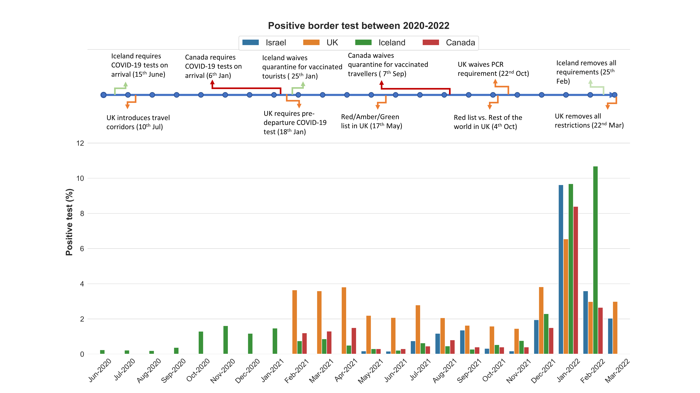
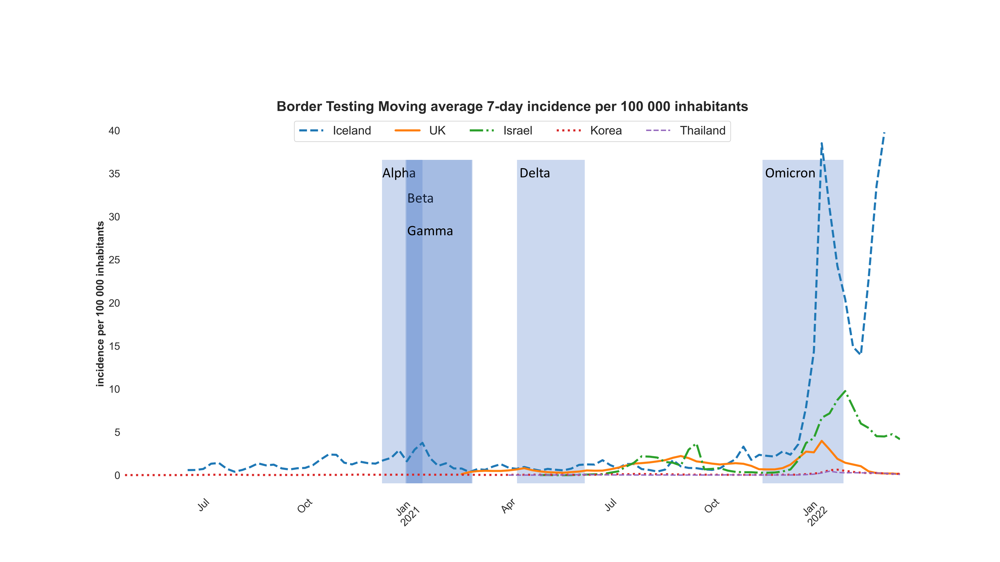
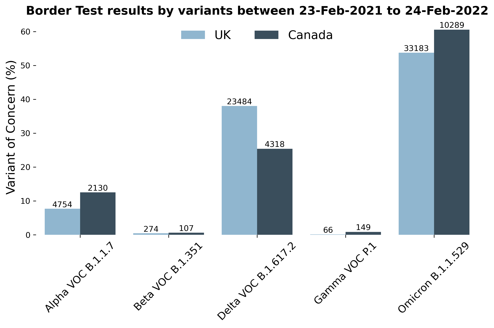
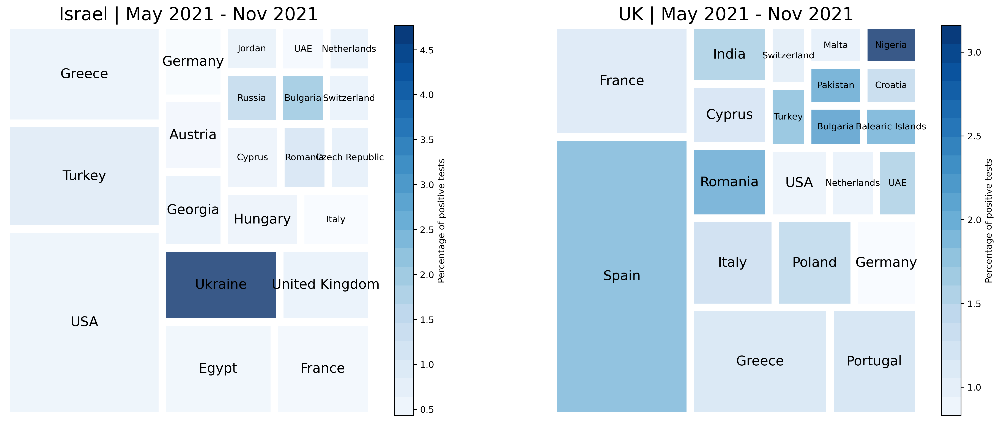

# Findings of comparison of border testing results between the UK and other countries
Note: raw data not uploaded

Files description:
* 1_File_preprocess.ipynb: Preprocess the downloaded data into a format for visualisation
* 2_UK_comparison.ipynb: Compare the border testing data between the UK and other countries
* analyses_code/preprocessing.py : all the preprocessing and visualising functions
* analyses_code/wayback_webscrapping.py: Function to scrape Korean daily positive cases data.
* dataset/preprocessed_data/* : Folders containing preprocessed data for each country. Used in the 2_UK_comparison.ipynb

Plots shown here:

Figure 1. Border testing result between multiple countries

Figure 2. Border testing moving average 70day incidence per 100 000 inhabitants

Figure 3. Variants comparison between UK and Canada

Figure 4. Countries of arrivals to the UK
